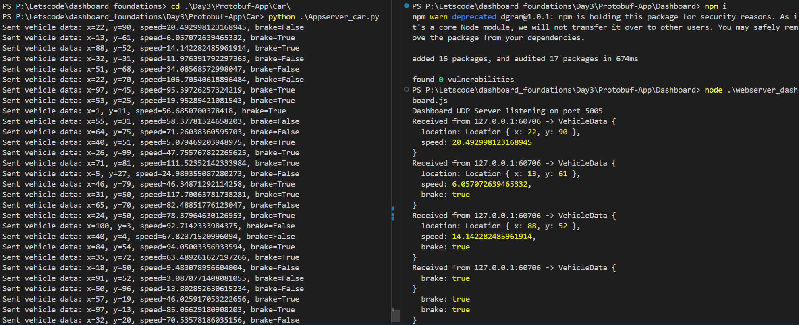

# Protobuf and UDP Communication Between Python (Sender) and Node.js (Receiver)

## 1. What is Protobuf?
Protocol Buffers (**Protobuf**) is a language-neutral, platform-neutral mechanism for **serializing structured data**. Developed by Google, Protobuf allows efficient data interchange between different systems, reducing overhead compared to JSON or XML.

### **Why Use Protobuf?**
- **Compact & Efficient**: Uses a binary format, reducing size compared to JSON.
- **Cross-Language Compatibility**: Works across different programming languages like **Python, JavaScript, C++, and more**.
- **Schema Evolution**: Can update schemas without breaking compatibility.
- **Fast Serialization & Deserialization**: Faster than JSON due to binary encoding.

---

## 2. How Protobufs Are Used for Serialization & Deserialization

Protobuf enables **efficient serialization and deserialization** between different systems. In this setup, a **Python-based vehicle telemetry system** (Sender) continuously transmits real-time data to a **Node.js dashboard** (Receiver) using UDP.

### **How It Works?**
1. **Define a `.proto` schema**: The schema includes structured data like vehicle location, speed, and brake status.
2. **Compile the `.proto` file**: Generate Python and JavaScript code from the schema.
3. **Python (Sender) serializes data**: Encodes structured data in a **compact binary format**.
4. **Send Data Over UDP**: Python continuously streams real-time data.
5. **Node.js (Receiver) deserializes data**: Decodes the binary message back into structured data.

---

## 3. Protobuf UDP Communication Example (Python Sender → Node.js Receiver)

### **Folder Structure**
```
Protobuf-App/
│── car/                # Python sender
│   ├── Appserver_car.py
│   ├── vehicle.proto
│   ├── vehicle_pb2.py  # Generated protobuf file
│
│── dashboard/          # Node.js receiver
│   ├── Appserver_dashboard.js
│   ├── vehicle.proto
│   ├── vehicle_pb.js   # Generated protobuf file
```

### **Step 1: Define the `.proto` File (`vehicle.proto`)**
```proto
syntax = "proto3";

message Location {
    int32 x = 1;
    int32 y = 2;
}

message VehicleData {
    Location location = 1;
    float speed = 2;
    bool brake = 3;
}
```

### **Step 2: Compile the Protobuf Schema**
#### **For Node.js (JavaScript) (Run in `dashboard/` folder)**
```sh
protoc --proto_path=. --js_out=import_style=commonjs,binary:. vehicle.proto
```
#### **For Python (Run in `car/` folder)**
```sh
protoc --proto_path=. --python_out=. vehicle.proto
```

### **Step 3: Implement Python Sender (Continuous Streaming UDP Data) (`car/Appserver_car.py`)**
```python
import socket
import vehicle_pb2  # Generated from vehicle.proto
import random
import time

UDP_IP = "127.0.0.1"
UDP_PORT = 5005

sock = socket.socket(socket.AF_INET, socket.SOCK_DGRAM)

while True:
    # Generate random vehicle data
    vehicle = vehicle_pb2.VehicleData(
        location=vehicle_pb2.Location(
            x=random.randint(0, 100),  # Random x-coordinate (0 to 100)
            y=random.randint(0, 100)   # Random y-coordinate (0 to 100)
        ),
        speed=random.uniform(0, 120),  # Random speed (0 to 120 km/h)
        brake=random.choice([True, False])  # Random brake status
    )

    # Serialize the message
    message_bytes = vehicle.SerializeToString()

    # Send the message over UDP
    sock.sendto(message_bytes, (UDP_IP, UDP_PORT))

    print(f"Sent vehicle data: x={vehicle.location.x}, y={vehicle.location.y}, speed={vehicle.speed}, brake={vehicle.brake}")

    # Wait for 1 second before sending the next message
    time.sleep(1)
```

### **Step 4: Implement Node.js Receiver (`dashboard/Appserver_dashboard.js`)**
```javascript
const dgram = require('dgram');
const protobuf = require('protobufjs');

protobuf.load("vehicle.proto", function(err, root) {
    if (err) throw err;
    const VehicleData = root.lookupType("VehicleData");

    const server = dgram.createSocket('udp4');

    server.on('message', (msg, rinfo) => {
        let decoded = VehicleData.decode(msg);
        console.log(`Received from ${rinfo.address}:${rinfo.port} ->`, decoded);
    });

    server.bind(5005, '127.0.0.1', () => {
        console.log('Node.js UDP Server listening on port 5005');
    });
});
```

---

## 4. How to Run the Code

### **Step 1: Install Dependencies**
#### **For Python (Run in `car/` folder)**
```sh
pip install protobuf
```
#### **For Node.js (Run in `dashboard/` folder)**
```sh
npm install dgram protobufjs
```

### **Step 2: Compile `.proto` File**
#### **Python (Run in `car/` folder)**
```sh
protoc --proto_path=. --python_out=. vehicle.proto
```
#### **Node.js (Run in `dashboard/` folder)**
```sh
protoc --proto_path=. --js_out=import_style=commonjs,binary:. vehicle.proto
```

### **Step 3: Start Node.js Receiver**
```sh
node Appserver_dashboard.js
```

### **Step 4: Start Python Sender**
```sh
python Appserver_car.py
```

Now, the Python sender will continuously stream **random vehicle data** to the Node.js receiver via UDP. The Node.js server will print the received messages in real-time.



---

## 5. Trade-offs and Other Means
### **Pros of Using Protobuf Over JSON**
✅ **Efficient Serialization**: Uses a compact binary format, reducing network load.
✅ **Faster Processing**: Faster parsing compared to JSON.
✅ **Schema Evolution**: Supports backward compatibility.
✅ **Cross-Platform**: Works across multiple languages (Node.js, Python, C++, etc.).

### **Cons of Using Protobuf**
❌ **Not Human-Readable**: Unlike JSON, Protobuf is binary and not easily readable.
❌ **Requires Compilation**: `.proto` files must be compiled before use.
❌ **Extra Learning Curve**: Needs additional tools (`protoc`, generated classes).

### **Alternative Approaches**
- **JSON over HTTP/WebSockets**: Easier to debug, but less efficient.
- **Message Queues (Kafka, RabbitMQ)**: Reliable but adds complexity.
- **gRPC (Google Remote Procedure Call)**: Uses Protobuf but over HTTP/2.

---

## **Conclusion**
This setup enables **real-time vehicle telemetry data transmission** using **Protobuf over UDP**, ensuring **low latency**, **efficient bandwidth usage**, and **cross-platform compatibility**. 🚀

